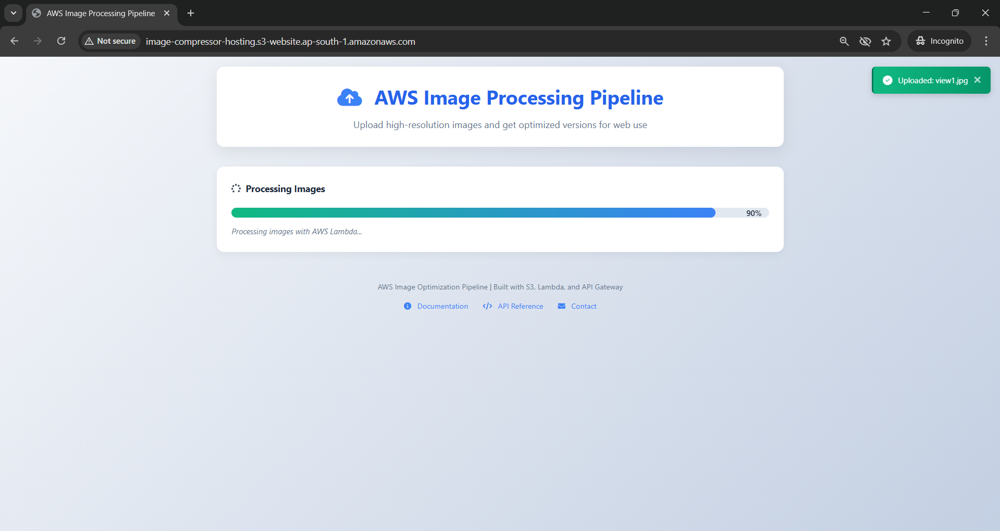
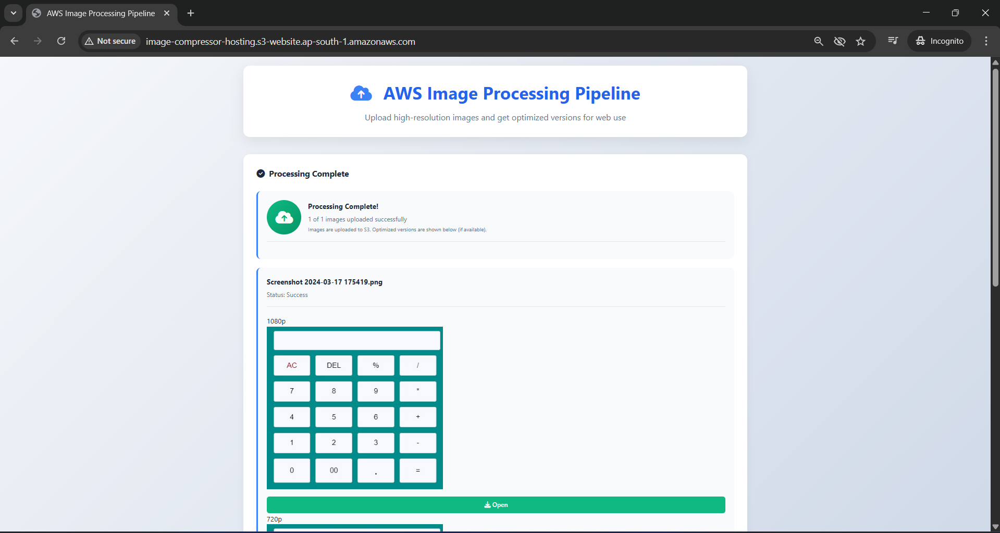

# 📷 **Cloud-Native Image Compressor**

A full-stack cloud-native image compression system built using AWS Serverless Backend and a modern frontend interface.
This project demonstrates strong hands-on skills in AWS Lambda, API Gateway, Python, Serverless Image Processing, and Web Development.

---

# 🚀 **Project Overview**

This system enables users to upload images, compress them, and download optimized versions instantly, powered completely by a serverless backend.

It includes:
* **Frontend:** HTML / CSS / JavaScript
* **Backend:** AWS Lambda (Python)
* **API Layer:** Amazon API Gateway

The Backend exposes a secure /optimize API endpoint, while the Frontend interacts with it to process images in real time.

---

# 🌐 **Live Project URL:** [S3 Hosting](http://image-compressor-hosting.s3-website.ap-south-1.amazonaws.com)

---

# 🖼️ **Application Screenshots (LIVE Demo)**

## **📤 User Interface**


## **⚙️ Image Compression in Progress**


## **📥 Download Optimized Image**


---

## 🧰 **Tech Stack**

### **Frontend**

* HTML
* CSS
* JavaScript (Fetch API)

### **Backend**
* AWS Lambda (Python)
* Amazon API Gateway
* Pillow (PIL) Image Processing
* Base64 Encoding/Decoding

---

# 🏗️ **Architecture**
```
Frontend (HTML/JS)
        |
        |  POST /optimize (image in base64)
        v
    API Gateway
        |
        v
    AWS Lambda (Python)
  - Decode image
  - Compress using Pillow
  - Return optimized image
        |
        v
Frontend (Download Result)
```

---

# **📁 Folder Structure**
```
cloud-image-compressor/
│
├── index.html
├── style.css
├── script.js
├── app.js
│
├── lambda/
│     ├── Lambda code.py
│     ├── Lambda code API.py
│     └── requirements.txt
│
└── README.md
```

---

# **⚙️ Backend Setup & Deployment**
### **1️⃣ Install Pillow (locally or in a Lambda layer)**
``` bash
pip install pillow -t .
```

### **2️⃣ Upload Lambda Code**

Upload:
``` bash
Lambda code.py
```
* Dependencies folder (Pillow)
* Any API-handling Lambda file

### **3️⃣ Create API Gateway Endpoint**
``` bash
POST /optimize
```
Enable:

* Lambda Proxy Integration
* CORS
* Binary media types (optional)

### **4️⃣ Test Lambda Manually**
``` bash
Example event:

{
  "fileName": "test.png",
  "fileData": "base64-image-data"
}
```

---

## **🎨 Frontend Setup**

* Open index.html
* Configure API endpoint inside script.js:
``` bash 
const apiUrl = "https://YOUR_API_ID.execute-api.ap-south-1.amazonaws.com/prod/optimize";
```
* Load UI in browser and test upload → compress → download cycle.

---

## **📌 Features**

* ✔️ 100% Serverless Architecture
* ✔️ Fast image optimization
* ✔️ Supports PNG/JPG/JPEG
* ✔️ Clean UI and simple UX
* ✔️ Extremely low cost (Lambda pay-per-use)
* ✔️ Works directly from browser

---

## **🧪 REST API Endpoints**
* Method	Endpoint	Description
* POST	/optimize	Upload + compress image
### **Sample Request**
``` bash
{
  "fileName": "demo.jpg",
  "fileData": "<base64-string>"
}
```
### **Sample Response**
``` bash
{
  "optimizedImage": "<base64-output>",
  "sizeBefore": 150230,
  "sizeAfter": 67210,
  "compressionRatio": 55.25
}
```

---

## **🎯 Project Goals**

* Demonstrate Cloud & Serverless architecture skills
* Build a real-world production-style application
* Show working API + frontend integration
* Deliver a clean, portfolio-ready project
  
---

## **👤 Author**

**Mohammed Rasool Shaik**

Cloud Engineer | AWS | DevOps | Backend Development


